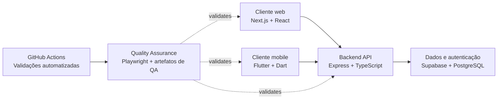

# OthersJob

### Um projeto de marketplace multiplataforma que conecta quem precisa contratar um serviço a quem está disponível para realizá-lo.

## O que é o OthersJob?

OthersJob é um projeto de software que explora um marketplace no qual contratantes podem publicar oportunidades de trabalho e prestadores podem aceitá-las e concluí-las. O ecossistema está dividido entre os repositórios web, backend, mobile, quality-assurance e repositórios de apoio, permitindo que cada área evolua com uma responsabilidade bem definida.

O projeto está em desenvolvimento ativo. Os repositórios apresentam fundamentos já implementados e planos documentados, mas ainda não representam uma plataforma concluída ou pronta para produção.

## Repositórios

| Repositório | Responsabilidade | Foco atual |
|---|---|---|
| [`web`](https://github.com/othersjob/web) | Experiência de uso no navegador | Landing page responsiva com identidade visual e componentes de interface reutilizáveis |
| [`backend`](https://github.com/othersjob/backend) | REST API e acesso a dados | Autenticação, conclusão de perfil, ciclo de vida dos trabalhos, documentação da API e migrations do Supabase |
| [`mobile`](https://github.com/othersjob/mobile) | Cliente multiplataforma | Base da aplicação Flutter e componentes reutilizáveis de design system |
| [`quality-assurance`](https://github.com/othersjob/quality-assurance) | Estratégia e validação de qualidade | Testes manuais, de API e automatizados, análise de riscos e test management |
| [`demo-repository`](https://github.com/othersjob/demo-repository) | Ambiente simples para recursos do GitHub | Exemplo estático em HTML e demonstrações de workflows |

> A visibilidade de alguns repositórios pode ser restrita. O perfil da organização permanece como a visão pública do ecossistema.

## Arquitetura

Os repositórios web e mobile formam as camadas de cliente. O backend fornece endpoints HTTP relacionados a autenticação, perfis e trabalhos, com persistência e autenticação apoiadas pelo Supabase. O Quality Assurance permanece independente do código das aplicações e valida o ecossistema por meio de test design documentado, requisições de API e verificações no navegador.

## Tech Stack

| Camada | Tecnologias encontradas nos repositórios |
|---|---|
| Web | Next.js, React, TypeScript, Tailwind CSS, Radix UI, Lucide |
| Backend | Node.js, Express, TypeScript, Supabase, PostgreSQL, JWT, Swagger/OpenAPI, Jest, Docker |
| Mobile | Flutter, Dart, Material, HTTP |
| Quality Assurance | Playwright, TypeScript, GitHub Actions |
| Demo | HTML, Primer CSS, GitHub Actions |

## Quality Assurance

O QA possui um repositório próprio para manter estratégia de testes, evidências, automação e análise de riscos independentes de uma única camada da aplicação. Essa separação permite avaliar a qualidade de todo o ecossistema enquanto os repositórios de produto permanecem focados na implementação.

O repositório contém atualmente:

- Test Plans, Test Cases, checklists, testes exploratórios e Bug Reports;
- planejamento de testes de API, validação de requests e responses e cobertura de status codes;
- análise de riscos, defect management, monitoramento e relatórios de resultados;
- técnicas de boundary value, equivalence partitioning, decision table e state transition;
- templates reutilizáveis de QA, orientações para evidências e análise dos repositórios;
- um framework Playwright + TypeScript para validações web, API, mobile web e demo.

O Playwright conecta-se às aplicações executadas de forma independente por meio de URLs configuradas no ambiente. O GitHub Actions está configurado para Pull Requests, pushes para `main`, execuções agendadas de Regression Tests e seleção manual de suítes, mantendo relatórios e artefatos de falha para análise.

A estabilização do CI/CD continua sendo um foco atual, pois as execuções automatizadas dependem de ambientes de teste acessíveis, repository secrets configurados corretamente, dados de teste confiáveis e alinhamento entre as aplicações implementadas e suas suítes de testes.

## Status Atual

| Área | Estado observado |
|---|---|
| Web | Landing page com identidade visual implementada; navegação e fluxos mais amplos do produto ainda não estão disponíveis |
| Backend | Endpoints principais de autenticação, perfil e trabalhos existem; metadados de dependências e defeitos de alto risco documentados precisam de atenção |
| Mobile | A base multiplataforma em Flutter e o design system existem; os fluxos da aplicação e o widget test atual precisam ser alinhados |
| QA | Há uma base ampla de documentação e automação; alguns cenários permanecem ignorados ou dependentes do ambiente |
| Integração | As responsabilidades dos repositórios estão definidas, mas a integração end-to-end do produto ainda está em andamento |

## Próximos Passos

- Expandir os clientes web e mobile além de suas bases atuais.
- Restaurar uma configuração reproduzível de dependências e build do backend.
- Resolver os riscos documentados de autorização, validação e consistência de pagamentos no backend.
- Alinhar os testes automatizados com as rotas implementadas, selectors e dados de teste controlados.
- Estabilizar o CI/CD em ambientes de teste controlados e tornar os resultados consistentemente acionáveis.
- Manter sincronizadas as documentações de arquitetura, API, QA e contribuição conforme o projeto evolui.

---

**OthersJob** · Web · Backend · Mobile · Quality Assurance

