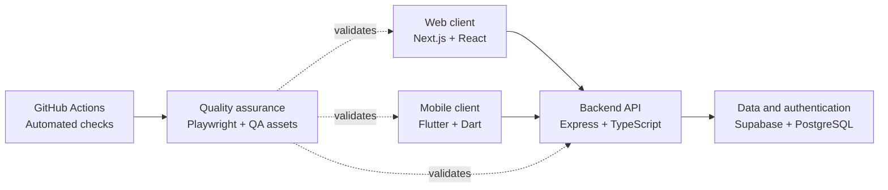

# OthersJob

### A multi-platform marketplace project connecting people who need work completed with people available to do it.

## What is OthersJob?

OthersJob is a software project exploring a marketplace where employers can publish work opportunities and executors can accept and complete them. The ecosystem is split across web, backend, mobile, quality assurance, and supporting repositories so each area can evolve with a clear responsibility.

The project is currently under active development. Its repositories show implemented foundations and documented plans, but they do not yet represent a finished or production-ready platform.

## Repositories

| Repository | Responsibility | Current focus |
|---|---|---|
| [`web`](https://github.com/othersjob/web) | Browser-based user experience | Branded responsive landing page and reusable interface components |
| [`backend`](https://github.com/othersjob/backend) | REST API and data access | Authentication, profile completion, job lifecycle, API documentation, and Supabase migrations |
| [`mobile`](https://github.com/othersjob/mobile) | Cross-platform client | Flutter application foundation and reusable design-system components |
| [`quality-assurance`](https://github.com/othersjob/quality-assurance) | Quality strategy and validation | Manual, API, automated, risk-based, and test-management assets |
| [`demo-repository`](https://github.com/othersjob/demo-repository) | Lightweight GitHub feature sandbox | Static HTML example and workflow demonstrations |

> Repository visibility may be restricted. The organization profile remains the public overview of the ecosystem.

## Architecture

The web and mobile repositories are client layers. The backend provides authentication, profile, and job-related HTTP endpoints backed by Supabase. Quality assurance is kept independent from application code and validates the ecosystem through documented test design, API requests, and browser-based checks.

## Technology Stack

| Layer | Technologies found in the repositories |
|---|---|
| Web | Next.js, React, TypeScript, Tailwind CSS, Radix UI, Lucide |
| Backend | Node.js, Express, TypeScript, Supabase, PostgreSQL, JWT, Swagger/OpenAPI, Jest, Docker |
| Mobile | Flutter, Dart, Material, HTTP |
| Quality | Playwright, TypeScript, GitHub Actions |
| Demo | HTML, Primer CSS, GitHub Actions |

## Quality Assurance

QA lives in its own repository to keep test strategy, evidence, automation, and risk analysis independent from any single application layer. This supports an ecosystem view of quality while allowing the product repositories to remain focused on implementation.

The repository currently includes:

- manual test plans, test cases, checklists, exploratory testing, and bug reports;
- API test planning, request/response validation, and status-code coverage;
- risk analysis, defect management, monitoring, and summary reporting;
- boundary value, equivalence partitioning, decision table, and state transition techniques;
- reusable QA templates, evidence guidance, and repository analysis;
- a Playwright + TypeScript framework for web, API, mobile-web, and demo checks.

Playwright connects to independently running applications through environment-based URLs. GitHub Actions is configured for pull requests, pushes to `main`, scheduled regression runs, and manual suite selection, with reports and failure artifacts retained for analysis.

CI stabilization remains a current focus because automated runs depend on reachable test environments, correctly configured repository secrets, reliable test data, and alignment between the implemented applications and their test suites.

## Current Status

| Area | Observed state |
|---|---|
| Web | Branded landing page implemented; broader navigation and product flows are not yet present |
| Backend | Core authentication, profile, and job endpoints exist; dependency metadata and documented high-risk defects need attention |
| Mobile | Cross-platform Flutter foundation and design system exist; application flows and the current widget test need alignment |
| QA | Broad documentation and automation foundations exist; some scenarios remain skipped or environment-dependent |
| Integration | Repository boundaries are defined, but end-to-end product integration is still in progress |

## Roadmap

- Expand the web and mobile clients beyond their current foundation.
- Restore a reproducible backend dependency and build setup.
- Resolve documented backend authorization, validation, and payment-consistency risks.
- Align automated tests with implemented routes, selectors, and seeded test data.
- Stabilize CI against controlled test environments and make results consistently actionable.
- Keep architecture, API, QA, and contributor documentation synchronized as the project evolves.

---

**OthersJob** · Web · Backend · Mobile · Quality Assurance

